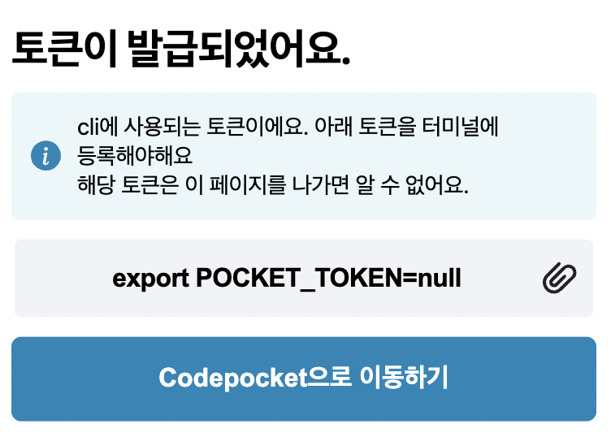

# hihihi



## gi

### hihi

```html
<div>
  <div>Header입니다.</div>
  <div>
    <div>네비게이션 바입니다.</div>
    <div>
      <div>컨텐츠 카드입니다.</div>
      <div>컨텐츠 카드입니다.</div>
      <div>컨텐츠 카드입니다.</div>
    </div>
    <div>사이드 바입니다.</div>
  </div>
  <div>Footer입니다.</div>
</div>
```

안녕하세요 정현수입니다.
저는 정현수이고요, 저는 정현수입니다.
